# The BAT DAO

## Initializing Setup

Copy .sample_env to .env and update the values.

## Prerequisities

- Install truffle, ganache and nodejs
- Clone this repo
- Create a new workspace in Ganache
- Link the truffle-config file to this workspace

## Compile and Test the contract

```
truffle compile

truffle test --name "BAT Advertisement Token" --symbol "BAV"
```

## Deploy the contract on Local Network

```
truffle migrate --network development --name "BAT Advertisement Token" --symbol "BAV"
```

## Verify

Check Ganache to verify that the two contracts have been created.

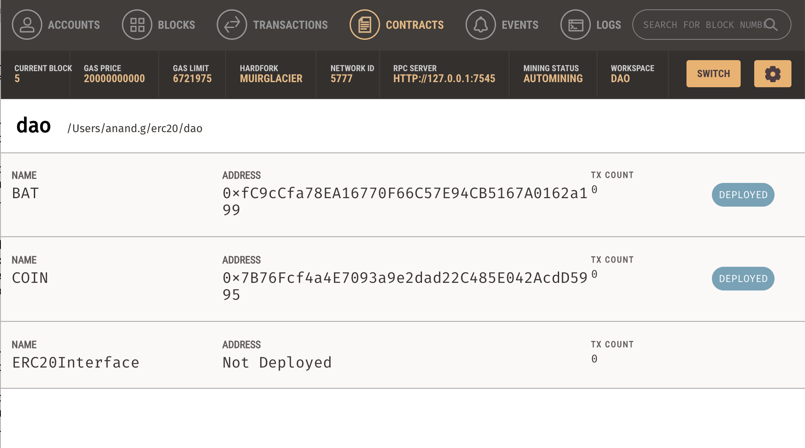
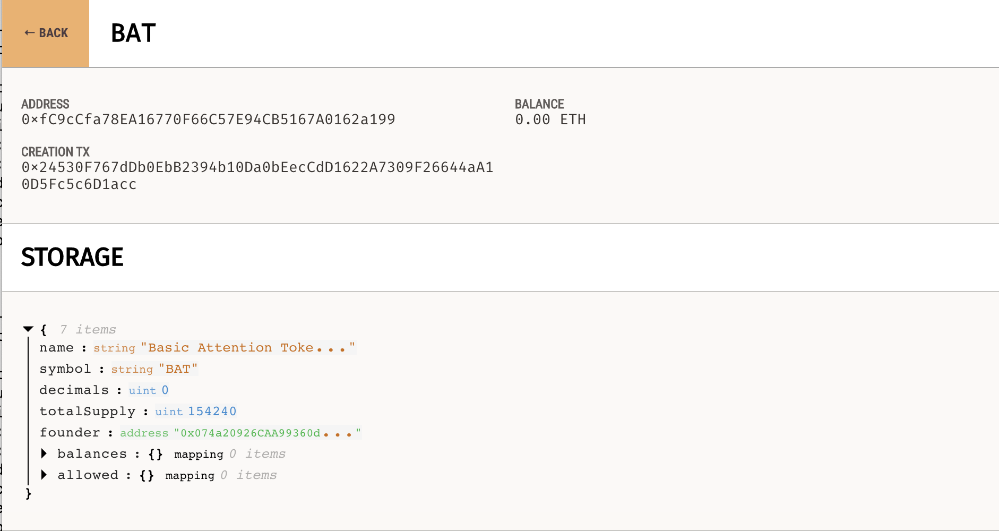
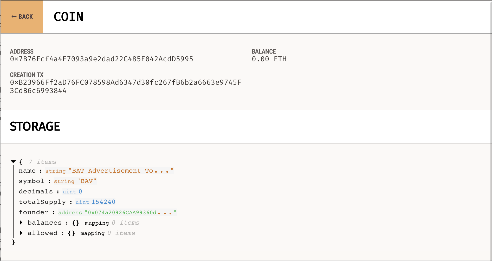

## Interact with contract deployed locally

```
truffle console --network development

const bat = await BAT.deployed()
await bat.name()
await bat.symbol()
(await bat.balanceOf('0x074a20926CAA99360d5DF53c45d8Fe45ff58F7B3')).toString()
(await bat.balanceOf('0x56bbf4a1918A4cE29986403C1ad3429C5786Ba45')).toString()
await bat.transfer('0x56bbf4a1918A4cE29986403C1ad3429C5786Ba45', 200000)
(await bat.balanceOf('0x074a20926CAA99360d5DF53c45d8Fe45ff58F7B3')).toString()
(await bat.balanceOf('0x56bbf4a1918A4cE29986403C1ad3429C5786Ba45')).toString()
```

## Deploy the contract on the Goerli Testnet

```
truffle migrate --network goerli --name "BAT Advertisement Token" --symbol "BAV"
```

## Verify that the contracts are deployed on Etherscan

#### BAT

https://goerli.etherscan.io/address/0x687f0E2361c533bC32B165c91D743819440F7bF2

#### BAV

https://goerli.etherscan.io/address/0xD18295e63813DAFDAd3E77AcC76845Ee5Daa59c6

### Interact with the BAT contract deployed on the Goerli Testnet

```
truffle console --network goerli

const bat = await BAT.deployed()
await bat.name()
await bat.symbol()
(await bat.balanceOf('0xdcD4412834a4683456175BC67b0AEF974312fff8')).toString()
(await bat.balanceOf('0x0579C299f70aae9f8a3c718c6637Cdd3829c2F49')).toString()
await bat.transfer('0x0579C299f70aae9f8a3c718c6637Cdd3829c2F49', 200000)
(await bat.balanceOf('0xdcD4412834a4683456175BC67b0AEF974312fff8')).toString()
(await bat.balanceOf('0x0579C299f70aae9f8a3c718c6637Cdd3829c2F49')).toString()
```

## Verify the transfer on Etherscan

https://goerli.etherscan.io/tx/0x3f8f01f158059ceaacf438a36589cd02949a2a524d93fd1981c645908dd25c0c

## Verify the transfer on Metamask

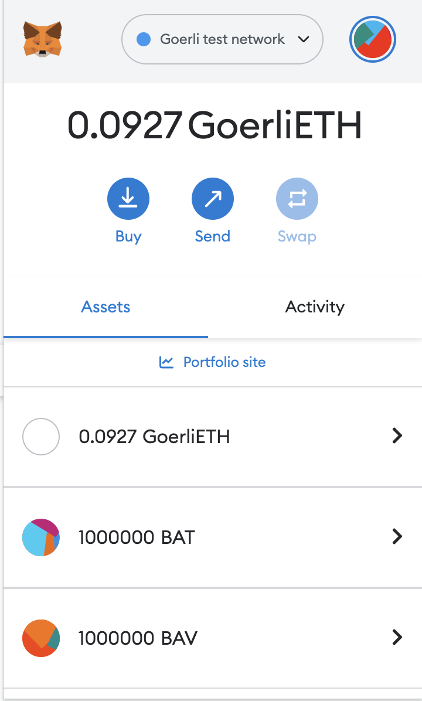
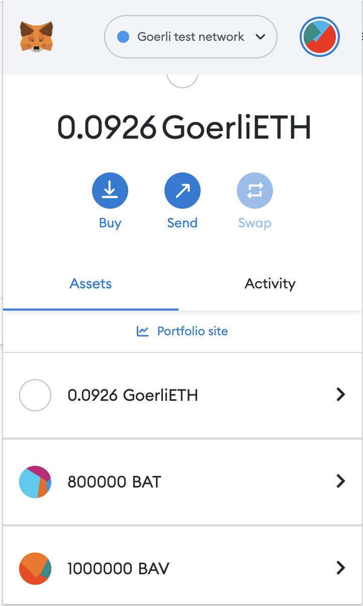
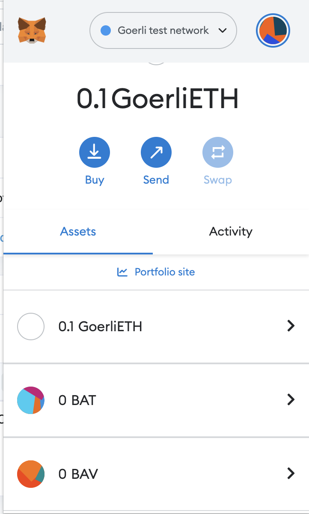
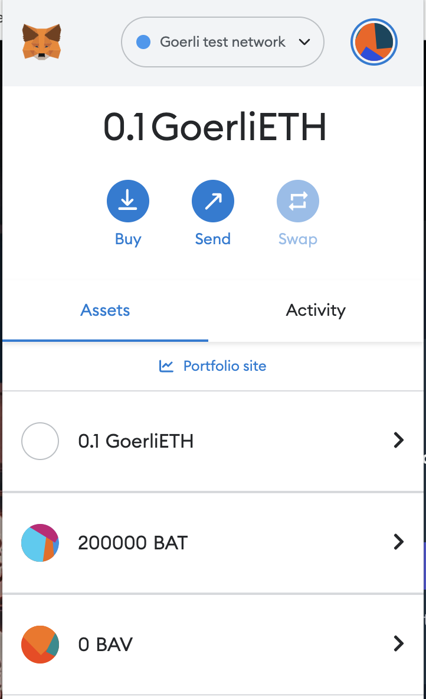

### Interact with the COIN contract deployed on the Goerli Testnet

```
truffle console --network goerli

const bav = await COIN.deployed()
await bav.name()
await bav.symbol()
(await bav.balanceOf('0xdcD4412834a4683456175BC67b0AEF974312fff8')).toString()
(await bav.balanceOf('0x0579C299f70aae9f8a3c718c6637Cdd3829c2F49')).toString()
await bav.transfer('0x0579C299f70aae9f8a3c718c6637Cdd3829c2F49', 300000)
(await bav.balanceOf('0xdcD4412834a4683456175BC67b0AEF974312fff8')).toString()
(await bav.balanceOf('0x0579C299f70aae9f8a3c718c6637Cdd3829c2F49')).toString()
```

## Verify the transfer on Etherscan

https://goerli.etherscan.io/tx/0x93e56273687fdb002a81b2a9ec8099b0d0a62cc01048a907d0f9ec77ee9445a7

## Verify the transfer on Metamask

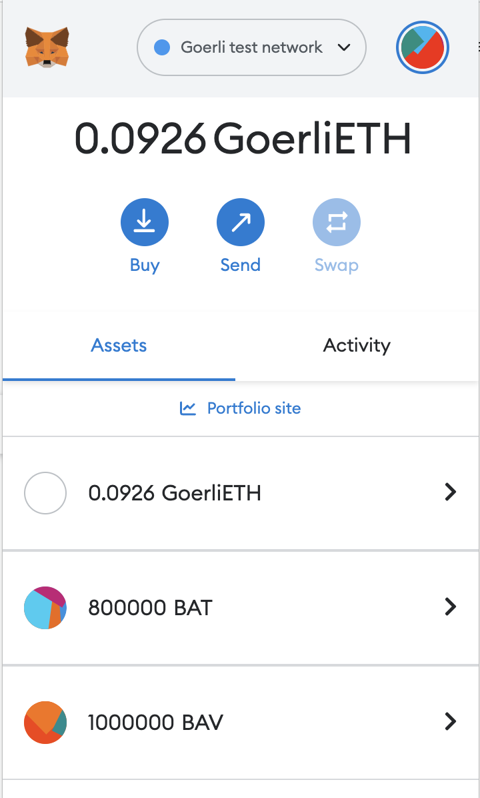
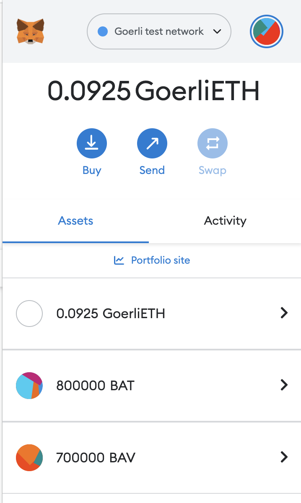
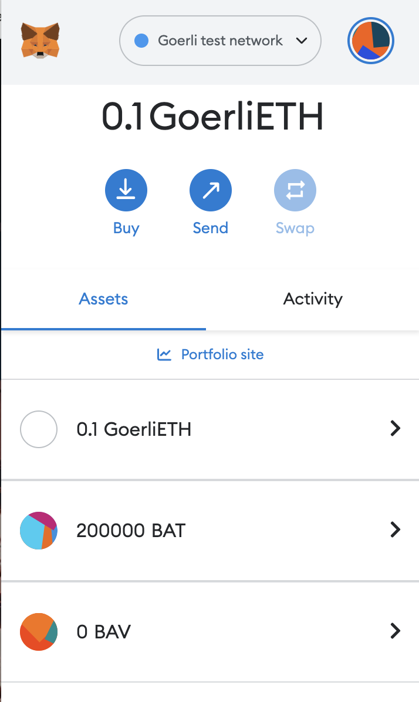
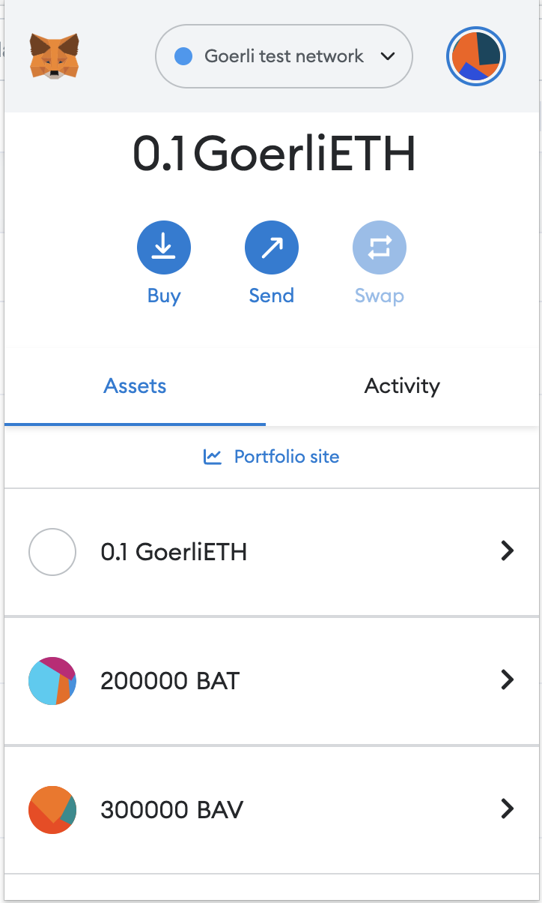

## Completion Status

- [x] ERC20 token
- [ ] Staking contract
- [ ] Voting contract
- [ ] UI
- [ ] Integrating the UI with the contract
